## Leverage the Microsoft Graph & 3rd Party APIs

In this lab you work with the SharePoint Framework to communicate with external APIs from the Microsoft Graph and third party REST APIs in your SharePoint Framework project.

## In this lab

- [Calling Anonymous 3rd Party REST APIs](#exercise1)
- [Calling Azure AD Secured 3rd Party REST APIs](#exercise2)
- [Working with the Microsoft Graph](#exercise3)

## Prerequisites

To complete this lab, you need the following:

- Office 365 tenancy
  > If you do not have one, you obtain one (for free) by signing up to the [Office 365 Developer Program](https://developer.microsoft.com/office/dev-program).
- Local SharePoint Framework development environment installed and configured
  - Refer to the SharePoint Framework documentation, specifically the **[Getting Started > Set up development environment](https://docs.microsoft.com/sharepoint/dev/spfx/set-up-your-development-environment)** for the most current steps

<a name="exercise1"></a>

## Exercise 1: Calling Anonymous 3rd Party REST APIs

In this exercise you will create a new SPFx project with a single client-side web part that uses React to display the contents from an anonymous 3rd Party API: the [NASA Image REST API](https://images.nasa.gov/docs/images.nasa.gov_api_docs.pdf).

### Create the SharePoint Framework Solution

1. Open a command prompt and change to the folder where you want to create the project.
1. Run the SharePoint Yeoman generator by executing the following command

    ```shell
    yo @microsoft/sharepoint
    ```

    Use the following to complete the prompt that is displayed:

    - **What is your solution name?**: SPFxHttpClient
    - **Which baseline packages do you want to target for your component(s)?**: SharePoint Online only (latest)
    - **Where do you want to place the files?**: Use the current folder
    - **Do you want to allow the tenant admin the choice of being able to deploy the solution to all sites immediately without running any feature deployment or adding apps in sites?**: No
    - **Will the components in the solution require permissions to access web APIs that are unique and not shared with other components in the tenant?**: No
    - **Which type of client-side component to create?**: WebPart
    - **What is your Web part name?**: SPFxHttpClient
    - **What is your Web part description?**: SPFxHttpClient description
    - **Which framework would you like to use?**: React

    After provisioning the folders required for the project, the generator will install all the dependency packages using NPM.

1. When NPM completes downloading all dependencies, open the project in Visual Studio Code.

1. Update the public interface for the React component:
    1. Locate and open the file **./src/webparts/spFxHttpClient/components/ISpFxHttpClientProps.ts**. This is the interface for the public properties on the React component. 
    1. Update the interface to replace the existing `description` property with a property that will hold a custom object. This object is quite complex and while you could create an interface to represent it, in this lab we will set that complexity aside and focus on consuming an untyped TypeScript object.

        ```ts
        export interface ISpFxHttpClientDemoProps {
          apolloMissionImage: any;
        }
        ```

1. Implement the user interface for the web part to display a list of items.
    1. Locate and open the file **./src/webparts/spFxHttpClient/components/SpFxHttpClient.module.scss**.
    1. Add the following classes to the bottom of the file, immediately before the closing `}`:

        ```css
        .list {
          color: $ms-color-themeDark;
          background-color: $ms-color-themeLight;
          font-family: 'Segoe UI Regular WestEuropean', 'Segoe UI', Tahoma, Arial, sans-serif;
          font-size: 14px;
          font-weight: normal;
          box-sizing: border-box;
          margin: 0 0;
          padding: 10px 0 100px 0;
          line-height: 50px;
          list-style-type: none;
        }

        .item {
          color: $ms-color-themeDark;
          background-color: $ms-color-themeLighterAlt;
          vertical-align: center;
          font-family: 'Segoe UI Regular WestEuropean', 'Segoe UI', Tahoma, Arial, sans-serif;
          font-size: 14px;
          font-weight: normal;
          box-sizing: border-box;
          margin: 0;
          padding: 0;
          box-shadow: none;
          *zoom: 1;
          padding: 0 15px;
          position: relative;
          box-shadow: 0 2px 4px 0 rgba(0, 0, 0, 0.2), 0 25px 50px 0 rgba(0, 0, 0, 0.1);
        }
        ```

    1. Locate and open the file **./src/webparts/spFxHttpClient/components/SpFxHttpClient.tsx**.
    1. Update the markup returned by the `render()` method to the following code. This will create a list using the CSS classes with each item displaying an image, the title of the image, and a list of keywords associated with the image:

        ```tsx
        <div className={ styles.spFxHttpClient }>
          <div className={ styles.container }>
            <div className={ styles.row }>
              <div className={ styles.column }>
                <span className={ styles.title }>HttpClient Demo</span>
              </div>
            </div>

            <div className={ styles.row }>
              
              <div><strong>Title:</strong> { this.props.apolloMissionImage.data[0].title }</div>
              <div><strong>Keywords:</strong></div>
              <ul className={ styles.list }>
                { this.props.apolloMissionImage &&
                  this.props.apolloMissionImage.data[0].keywords.map((keyword) =>
                    <li key={ keyword} className={ styles.item }>
                      { keyword }
                    </li>
                  )
                }
              </ul>
            </div>

          </div>
        </div>
        ```

1. Implement the web part logic to retrieve data from the remote service and set it on the public property for the React component:
    1. Locate and open the **./src/webparts/spFxHttpClient/SpFxHttpClientWebPart.ts** file.
    1. Add the following `import` statement to the top of the file after the existing `import` statements:

        ```ts
        import { HttpClient, HttpClientResponse } from '@microsoft/sp-http';
        ```

    1. Add the following method to the `SpFxHttpClientWebPart` class:

        ```ts
        private _getApolloImage(): Promise<any> {
          return this.context.httpClient.get(
            `https://images-api.nasa.gov/search?q=Apollo%204&media_type=image`,
            HttpClient.configurations.v1
          )
          .then((response: HttpClientResponse) => {
            return response.json();
          })
          .then(jsonResponse => {
            return jsonResponse;
          }) as Promise<any>;
        }
        ```

        This method uses the `HttpClient` available from the current SharePoint context and issues an HTTP GET request to the NASA Imagery REST API with the query test of **Apollo 4**. After processing the response to JSON, it is returned to the caller as an untyped `any` object.

    1. Update the contents of the `render()` method to the following code:

        ```ts
        public render(): void {
          if (!this.renderedOnce) {
            this._getApolloImage()
              .then(response => {
                const element: React.ReactElement<ISpFxHttpClientProps > = React.createElement(
                  SpFxHttpClient,
                  {
                    apolloMissionImage: response.collection.items[0]
                  }
                );

                ReactDom.render(element, this.domElement);
              });
          }
        }
        ```

        In this code, we have added a check to see if the web part has already been rendered on the page. If not, it calls the `_getApolloImage()` method previously added. When it receives a response, it attaches the first item in the results returned by the NASA Imagery REST API.

1. Test the web part:
    1. Start the local web server and test the web part in the hosted workbench:

        ```shell
        gulp serve
        ```

    1. Add the web part to the workbench:
        1. When the workbench loads in a browser, select the *plus* icon to open the toolbox:

            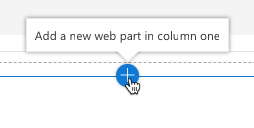

        1. Select the web part from the toolbox:

            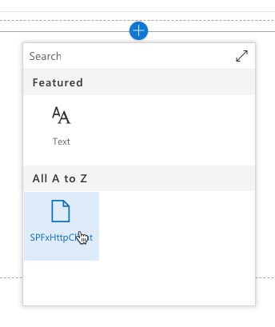

    1. Observe when the web part renders, it shows data from the NASA Imagery REST API:

        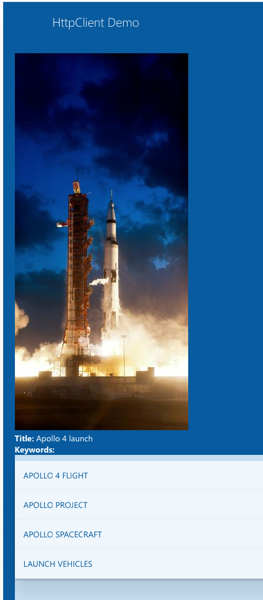

1. Stop the local web server by pressing <kbd>CTRL</kbd>+<kbd>C</kbd> in the console/terminal window.

<a name="exercise2"></a>

## Exercise 2: Calling Azure AD Protected 3rd Party REST APIs

In this exercise you will create a new SPFx project with a single client-side web part that uses React and the Microsoft Graph with the to display users in the currently logged in user's directory. You will use the Azure AD HTTP client API included in the SharePoint Framework to authenticate and call the Microsoft Graph REST API.

1. Open a command prompt and change to the folder where you want to create the project.
1. Run the SharePoint Yeoman generator by executing the following command

    ```shell
    yo @microsoft/sharepoint
    ```

    Use the following to complete the prompt that is displayed:

    - **What is your solution name?**: SPFxAadHttpClient
    - **Which baseline packages do you want to target for your component(s)?**: SharePoint Online only (latest)
    - **Where do you want to place the files?**: Use the current folder
    - **Do you want to allow the tenant admin the choice of being able to deploy the solution to all sites immediately without running any feature deployment or adding apps in sites?**: No
    - **Will the components in the solution require permissions to access web APIs that are unique and not shared with other components in the tenant?**: No
    - **Which type of client-side component to create?**: WebPart
    - **What is your Web part name?**: SPFxAadHttpClient
    - **What is your Web part description?**: SPFxAadHttpClient
    - **Which framework would you like to use?**: React

    After provisioning the folders required for the project, the generator will install all the dependency packages using NPM.

1. When NPM completes downloading all dependencies, open the project in Visual Studio Code.
1. This application will retrieve a list of users from the Microsoft Graph. To simplify working with the response, create an interface that reflects the results of the query:
    1. Locate the **./src** folder in the project.
    1. Create a new folder **models** in the existing **./src** folder.
    1. Add a new file, **IUserItem.ts**, to the **models** folder with the following code:

        ```ts
        export interface IUserItem {
          id: string;
          mail?: string;
          displayName?: string;
        }
        ```

1. Implement the user interface for the web part to display a list of items.
    1. Update the public interface of the React component to accept a collection of users.

        Locate and open the file **./src/webparts/spFxAadHttpClient/components/ISpFxAadHttpClientProps.ts**.
    1. Update the contents of the file to match the following code:

        ```ts
        import { IUserItem } from '../../../models/IUserItem';

        export interface ISpFxAadHttpClientProps {
          userItems: IUserItem[];
        }
        ```

    1. Locate and open the file **./src/webparts/spFxAadHttpClient/components/SpFxAadHttpClient.module.scss**.
    1. Add the following classes to the bottom of the file, immediately before the closing `}`:

        ```css
        .list {
          color: $ms-color-themeDark;
          background-color: $ms-color-themeLight;
          font-family: 'Segoe UI Regular WestEuropean', 'Segoe UI', Tahoma, Arial, sans-serif;
          font-size: 14px;
          font-weight: normal;
          box-sizing: border-box;
          margin: 0 0;
          padding: 10px 0 100px 0;
          line-height: 50px;
          list-style-type: none;
        }

        .item {
          color: $ms-color-themeDark;
          background-color: $ms-color-themeLighterAlt;
          vertical-align: center;
          font-family: 'Segoe UI Regular WestEuropean', 'Segoe UI', Tahoma, Arial, sans-serif;
          font-size: 14px;
          font-weight: normal;
          box-sizing: border-box;
          margin: 0;
          padding: 0;
          box-shadow: none;
          *zoom: 1;
          padding: 0 15px;
          position: relative;
          box-shadow: 0 2px 4px 0 rgba(0, 0, 0, 0.2), 0 25px 50px 0 rgba(0, 0, 0, 0.1);
        }
        ```

    1. Locate and open the file **./src/webparts/spFxAadHttpClient/components/SpFxAadHttpClient.tsx**.
    1. Update the markup returned by the `render()` method to the following code. This will create a list using the CSS classes with each item displaying a list of the users returned from the call to the Microsoft Graph:

        ```tsx
        <div className={ styles.spFxAadHttpClient }>
          <div className={ styles.container }>
            <div className={ styles.row }>
              <div className={ styles.column }>
                <span className={ styles.title }>AadHttpClient Demo</span>
              </div>
            </div>

            <div className={ styles.row }>
              <div><strong>Mail:</strong></div>
              <ul className={ styles.list }>
                { this.props.userItems &&
                  this.props.userItems.map((user) =>
                    <li key={ user.id } className={ styles.item }>
                      <strong>ID:</strong> { user.id }<br />
                      <strong>Email:</strong> { user.mail }<br />
                      <strong>DisplayName:</strong> { user.displayName }
                    </li>
                  )
                }
              </ul>
            </div>

          </div>
        </div>
        ```

1. Update the web part code to call the Microsoft Graph using the `AadHttpClient` API.
    1. Locate and open the file **./src/webparts/spFxAadHttpClient/SpFxAadHttpClientWebPart.ts**.
    1. Add the following `import` statements immediately following the existing `import` statements:

        ```ts
        import { IUserItem } from '../../models/IUserItem';
        import { AadHttpClient, HttpClientResponse } from '@microsoft/sp-http';
        ```

    1. Add the following method to the `SpFxAadHttpClientWebPart` class.

        This method will first obtain an instance of the Azure AD HTTP client API that has been configured with the necessary details, including the authentication HTTP header, to call the Microsoft Graph.

        It will then use that `aadClient` object to issue an HTTP GET request to the Microsoft Graph endpoint, requesting first 10 users for the current logged in user.

        Once a response is received, the body is processed as JSON and the collection of users is resolved in the JavaScript promise:

        ```ts
        private _getUsers(): Promise<IUserItem[]> {
          return new Promise<IUserItem[]>((resolve, reject) => {
            this.context.aadHttpClientFactory
              .getClient('https://graph.microsoft.com')
              .then((aadClient: AadHttpClient) => {
                const endpoint: string = 'https://graph.microsoft.com/v1.0/users?$top=10&$select=id,displayName,mail';
                aadClient.get(endpoint, AadHttpClient.configurations.v1)
                  .then((rawResponse: HttpClientResponse) => {
                    return rawResponse.json();
                  })
                  .then((jsonResponse: any) => {
                    resolve(jsonResponse.value);
                  });
              });
            });
        }
        ```

    1. Update the contents of the `render()` method to the following code:

        ```ts
        public render(): void {
          if (!this.renderedOnce) {
            this._getUsers()
              .then((results: IUserItem[]) => {
                const element: React.ReactElement<ISpFxAadHttpClientProps > = React.createElement(
                  SpFxAadHttpClient,
                  {
                    userItems: results
                  }
              );

              ReactDom.render(element, this.domElement);
            });
          }
        }
        ```

        In this code, we have added a check to see if the web part has already been rendered on the page. If not, it calls the `_getUsers()` method previously added.        

### Update the Package Permission Requests

The last step before testing is to notify SharePoint that upon deployment to production, this app requires permission to the Microsoft Graph API.

1. Open the **./config/package-solution.json** file.
1. Locate the `solution` section. Add the following permission request element just after the property `isDomainIsolated`:

    ```json
    "webApiPermissionRequests": [
      {
        "resource": "Microsoft Graph",
        "scope": "User.ReadBasic.All"
      }
    ]
    ```

### Test the Web Part

1. Create the SharePoint package for deployment:
    1. Build the solution by executing the following on the command line:

        ```shell
        gulp build
        ```

    1. Bundle the solution by executing the following on the command line:

        ```shell
        gulp bundle --ship
        ```

    1. Package the solution by executing the following on the command line:

        ```shell
        gulp package-solution --ship
        ```

1. Deploy and trust the SharePoint package:
    1. In the browser, navigate to your SharePoint Online Tenant App Catalog.

        >Note: Creation of the Tenant App Catalog site is one of the steps in the **[Getting Started > Set up Office 365 Tenant](https://docs.microsoft.com/sharepoint/dev/spfx/set-up-your-developer-tenant)** setup documentation.

    1. Select the **Apps for SharePoint** link in the navigation:

        

    1. Drag the generated SharePoint package from **/sharepoint/solution/sp-fx-aad-http-client.sppkg** into the **Apps for SharePoint** library.
    1. In the **Do you trust sp-fx-aad-http-client-side-solution?** dialog, select **Deploy**.

        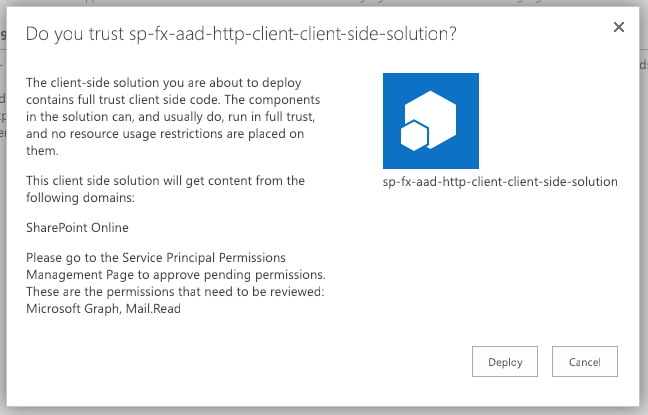

1. Approve the API permission request:
    1. Navigate to the SharePoint Admin Portal located at **https://{{REPLACE_WITH_YOUR_TENANTID}}-admin.sharepoint.com/_layouts/15/online/AdminHome.aspx**, replacing the domain with your SharePoint Online's administration tenant URL.

        >Note: At the time of writing, this feature is only in the SharePoint Online preview portal.

    1. In the navigation, select **Advanced > API Management**:

        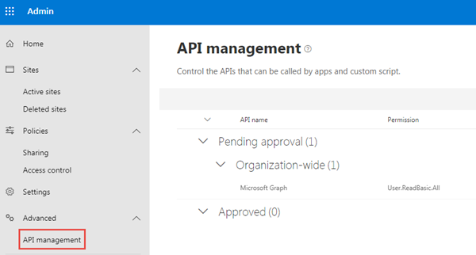

    1. Select the **Pending approval** for the **Microsoft Graph** permission **User.ReadBasic.All**.

        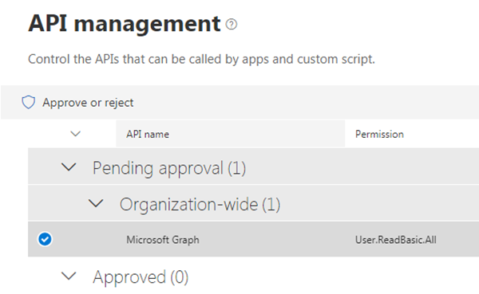

    1. Select the **Approve or Reject** button, followed by selecting **Approve**.

        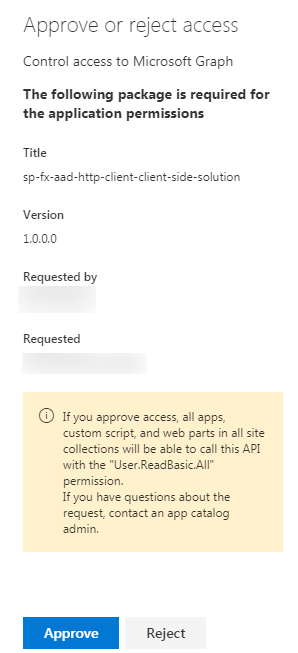

1. Test the web part:

    >NOTE: The SharePoint Framework includes a locally hosted & SharePoint Online hosted workbench for testing custom solutions. However, the workbench will not work the first time when testing solutions that utilize the Microsoft Graph due to nuances with how the workbench operates and authentication requirements. Therefore, the first time you test a Microsoft Graph enabled SPFx solution, you will need to test them in a real modern page.
    >
    >Once this has been done and your browser has been cookied by the Azure AD authentication process, you can leverage local webserver and SharePoint Online-hosted workbench for testing the solution.

    1. Add the web part to your site collection.
        1. In a browser, navigate to a SharePoint Online site.
        1. In the Office 365 gear, select **Add an App**.
        1. In site navigation, select **From your Organization**.
        1. Select `sp-fx-aad-http-client-side-solution` to add your web part.

        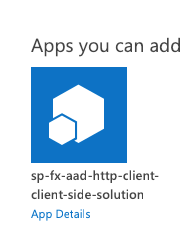

    1. Setup environment to test the web part on a real SharePoint Online modern page in the same site collection where you added your web part:
        1. In the site navigation, select the **Pages** library.
        1. Select an existing page (*option 2 in the following image*), or create a new page (*option 1 in the following image*) in the library to test the web part on.

            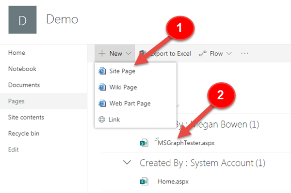

    1. Add the web part to the page and test:
        1. In the browser, select the Web part icon button to open the list of available web parts:

            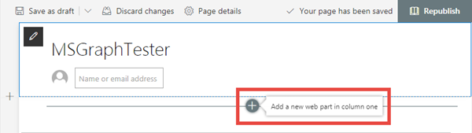

        1. Locate the **SPFxAadHttpClient** web part and select it

            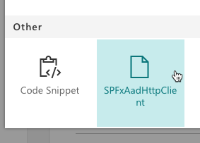

        1. When the page loads, notice after a brief delay, it will display a list of users:

            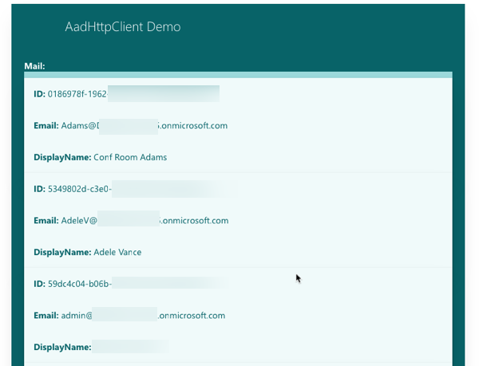

<a name="exercise3"></a>

## Exercise 3: Calling the Microsoft Graph

In this exercise you will create a new SPFx project with a single client-side web part that uses React and the Microsoft Graph to display the currently logged in user's personal details in a familiar office [Persona](https://developer.microsoft.com/fabric#/components/persona) card. You will use the Microsoft Graph HTTP client API included in the SharePoint Framework to authenticate and call the Microsoft Graph REST API.

### Create the Persona SPFx Solution

1. Open a command prompt and change to the folder where you want to create the project.
1. Run the SharePoint Yeoman generator by executing the following command

    ```shell
    yo @microsoft/sharepoint
    ```

    Use the following to complete the prompt that is displayed:

    - **What is your solution name?**: MSGraphSPFx
    - **Which baseline packages do you want to target for your component(s)?**: SharePoint Online only (latest)
    - **Where do you want to place the files?**: Use the current folder
    - **Do you want to allow the tenant admin the choice of being able to deploy the solution to all sites immediately without running any feature deployment or adding apps in sites?**: No
    - **Will the components in the solution require permissions to access web APIs that are unique and not shared with other components in the tenant?**: No
    - **Which type of client-side component to create?**: WebPart
    - **What is your Web part name?**: GraphPersona
    - **What is your Web part description?**: Display current user's persona details in a Fabric React Persona card
    - **Which framework would you like to use?**: React

    After provisioning the folders required for the project, the generator will install all the dependency packages using NPM.

1. When NPM completes downloading all dependencies, open the project in Visual Studio Code.

### Update Persona Solution Dependencies

1. Install the Microsoft Graph TypeScript type declarations by executing the following statement on the command line:

    ```shell
    npm install @microsoft/microsoft-graph-types --save-dev
    ```

### Update the Persona Web Part

Update the default web part to pass into the React component an instance of the Microsoft Graph client API:

1. Open the web part file **src/webparts/graphPersona/GraphPersonaWebPart.ts**.
1. Add the following `import` statements after the existing `import` statements:

    ```ts
    import { MSGraphClient } from '@microsoft/sp-http';
    ```

1. Locate the `render()` method. This method creates a new instance of a React element by passing in the component class and the properties to bind to it. The only property being set is the `description` property.

    Replace the contents of the `render()` method with the following code to create an initialize a new instance fo the Microsoft Graph client:

    ```ts
    this.context.msGraphClientFactory.getClient()
    .then((client: MSGraphClient): void => {
      const element: React.ReactElement<IGraphPersonaProps> = React.createElement(
        GraphPersona,
        {
          graphClient: client
        }
      );

      ReactDom.render(element, this.domElement);
    });
    ```
    >Note: the public property of the GraphPersona `graphClient` will be defined in the next step.

### Implement the GraphPersona React Component

1. After updating the public signature of the **GraphPersona** component, the public property interface of the component needs to be updated to accept the Microsoft Graph client:
    1. Open the **src/webparts/graphPersona/components/IGraphPersonaProps.ts**
    1. Replace the contents with the following code to change the public signature of the component:

        ```ts
        import { MSGraphClient } from '@microsoft/sp-http';

        export interface IGraphPersonaProps {
          graphClient: MSGraphClient;
        }
        ```

1. Create a new interface that will keep track of the state of the component's state:
    1. Create a new file **IGraphPersonaState.ts** and save it to the folder: **src/webparts/graphResponse/components/**.
    1. Add the following code to define a new state object that will be used by the component:

        ```ts
        export interface IGraphPersonaState {
          name: string;
          email: string;
          phone: string;
          image: string;
        }
        ```

1. Update the component's references to add the new state interface, support for the Microsoft Graph, Fabric React Persona control and other necessary controls.
    1. Open the **src/webparts/graphPersona/components/GraphPersona.tsx**
    1. Add the following `import` statements after the existing `import` statements:

        ```ts
        import { IGraphPersonaState } from './IGraphPersonaState';

        import { MSGraphClient } from '@microsoft/sp-http';
        import * as MicrosoftGraph from '@microsoft/microsoft-graph-types';

        import {
          Persona,
          PersonaSize
        } from 'office-ui-fabric-react/lib/components/Persona';
        import { Link } from 'office-ui-fabric-react/lib/components/Link';
        ```

1. Update the public signature of the component to include the state:
    1. Locate the class `GraphPersona` declaration.
    1. At the end of the line, notice there is generic type with two parameters, the second is an empty object `{}`:

        ```ts
        export default class GraphPersona extends React.Component<IGraphPersonaProps, {}>
        ```

    1. Update the second parameter to be the state interface previously created:

        ```ts
        export default class GraphPersona extends React.Component<IGraphPersonaProps, IGraphPersonaState>
        ```

1. Add the following constructor to the `GraphPersona` class to initialize the state of the component:

    ```ts
    constructor(props: IGraphPersonaProps) {
      super(props);

      this.state = {
        name: '',
        email: '',
        phone: '',
        image: null
      };
    }
    ```

1. Add the Fabric React Persona card to the `render()` method's return statement:

    ```ts
    public render(): React.ReactElement<IGraphPersonaProps> {
      return (
        <Persona primaryText={this.state.name}
                secondaryText={this.state.email}
                onRenderSecondaryText={this._renderMail}
                tertiaryText={this.state.phone}
                onRenderTertiaryText={this._renderPhone}
                imageUrl={this.state.image}
                size={PersonaSize.size100} />
      );
    }
    ```

1. The code in the Persona card references two utility methods to control rendering of the secondary & tertiary text. Add the following to methods to the `GraphPersona` class that will be used to render the text accordingly:

    ```ts
    private _renderMail = () => {
      if (this.state.email) {
        return <Link href={`mailto:${this.state.email}`}>{this.state.email}</Link>;
      } else {
        return <div />;
      }
    }

    private _renderPhone = () => {
      if (this.state.phone) {
        return <Link href={`tel:${this.state.phone}`}>{this.state.phone}</Link>;
      } else {
        return <div />;
      }
    }
    ```

1. The last step is to update the loading, or *mounting* phase of the React component. When the component loads on the page, it should call the Microsoft Graph to get details on the current user as well as their photo. When each of these results complete, they will update the component's state which will trigger the component to rerender.

    Add the following method to the `GraphPersona` class:

    ```ts
    public componentDidMount(): void {
      this.props.graphClient
        .api('me')
        .get((error: any, user: MicrosoftGraph.User, rawResponse?: any) => {
          this.setState({
            name: user.displayName,
            email: user.mail,
            phone: user.businessPhones[0]
          });
        });

      this.props.graphClient
        .api('/me/photo/$value')
        .responseType('blob')
        .get((err: any, photoResponse: any, rawResponse: any) => {
          const blobUrl = window.URL.createObjectURL(photoResponse);
          this.setState({ image: blobUrl });
        });
    }
    ```

### Update the Persona SPFx Package Permission Requests

The last step before testing is to notify SharePoint that upon deployment to production, this app requires permission to the Microsoft Graph to access the user's persona details.

1. Open the **config/package-solution.json** file.
1. Locate the `solution` section. Add the following permission request element just after the property `isDomainIsolated`:

    ```json
    "webApiPermissionRequests": [
      {
        "resource": "Microsoft Graph",
        "scope": "User.ReadBasic.All"
      }
    ]
    ```

### Test the Persona Solution

1. Create the SharePoint package for deployment:
    1. Build the solution by executing the following on the command line:

        ```shell
        gulp build
        ```

    1. Bundle the solution by executing the following on the command line:

        ```shell
        gulp bundle --ship
        ```

    1. Package the solution by executing the following on the command line:

        ```shell
        gulp package-solution --ship
        ```

1. Deploy and trust the SharePoint package:
    1. In the browser, navigate to your SharePoint Online Tenant App Catalog.

        >Note: Creation of the Tenant App Catalog site is one of the steps in the **[Getting Started > Set up Office 365 Tenant](https://docs.microsoft.com/sharepoint/dev/spfx/set-up-your-developer-tenant)** setup documentation.

    1. Select the **Apps for SharePoint** link in the navigation:

        

    1. Drag the generated SharePoint package from **/sharepoint/solution/ms-graph-sp-fx.sppkg** into the **Apps for SharePoint** library.
    1. In the **Do you trust ms-graph-sp-fx-client-side-solution?** dialog, select **Deploy**.

        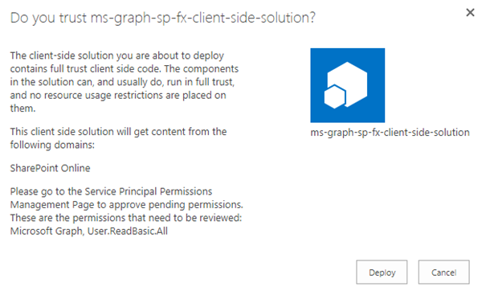

1. Approve the API permission request:

    >Note: If you completed Exercise 2 in this module you have already approved the permission request for **User.ReadBasic.All** so you may skip this step and move to testing the web part.

    1. Navigate to the SharePoint Admin Portal located at **https://{{REPLACE_WITH_YOUR_TENANTID}}-admin.sharepoint.com/_layouts/15/online/AdminHome.aspx**, replacing the domain with your SharePoint Online's administration tenant URL.

        >Note: At the time of writing, this feature is only in the SharePoint Online preview portal.

    1. In the navigation, select **Advanced > API Management**:

        

    1. Select the **Pending approval** for the **Microsoft Graph** permission **User.ReadBasic.All**.

        

    1. Select the **Approve or Reject** button, followed by selecting **Approve**.

        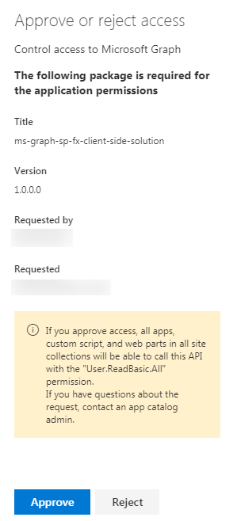

1. Test the web part:

    >NOTE: The SharePoint Framework includes a locally hosted & SharePoint Online hosted workbench for testing custom solutions. However, the workbench will not work the first time when testing solutions that utilize the Microsoft due to nuances with how the workbench operates and authentication requirements. Therefore, the first time you test a Microsoft Graph enabled SPFx solution, you will need to test them in a real modern page.
    >
    >Once this has been done and your browser has been cookied by the Azure AD authentication process, you can leverage local webserver and SharePoint Online-hosted workbench for testing the solution.

    1. Add the web part to your site collection.
        1. In a browser, navigate to a SharePoint Online site.

        1. In the Office 365 gear, select **Add an App**.

        1. In site navigation, select **From your Organization**.

        1. Select `ms-graph-sp-fx-client-side-solution` to add your web part.

    1. Setup environment to test the web part on a real SharePoint Online modern page in the same site collection where you added your web part:
        1. In the site navigation, select the **Pages** library.
        1. Select an existing page (*option 2 in the following image*), or create a new page (*option 1 in the following image*) in the library to test the web part on.

            

    1. Add the web part to the page and test:
        1. In the browser, select the Web part icon button to open the list of available web parts:

            

        1. Locate the **GraphPersona** web part and select it

            

        1. When the page loads, notice after a brief delay, it will display the current user's details on the Persona card:

            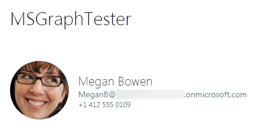
